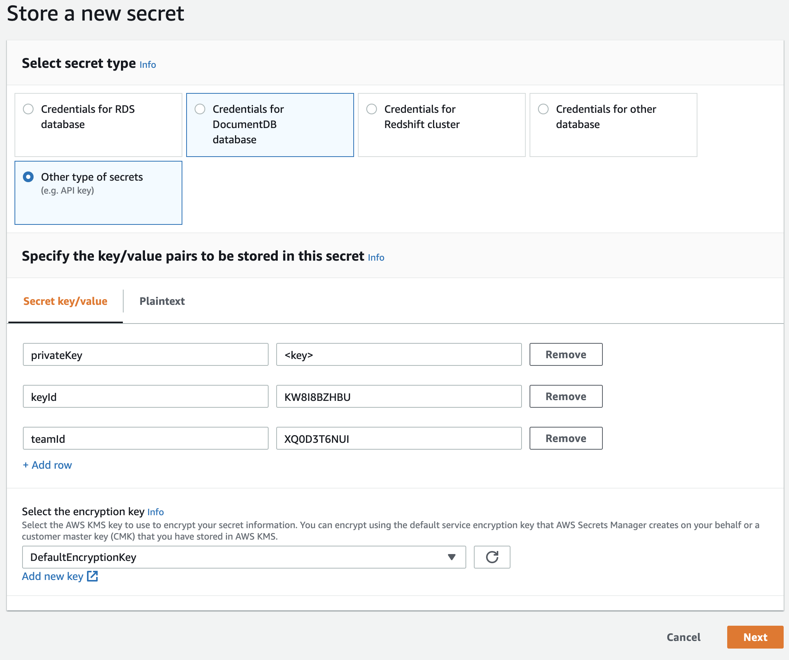
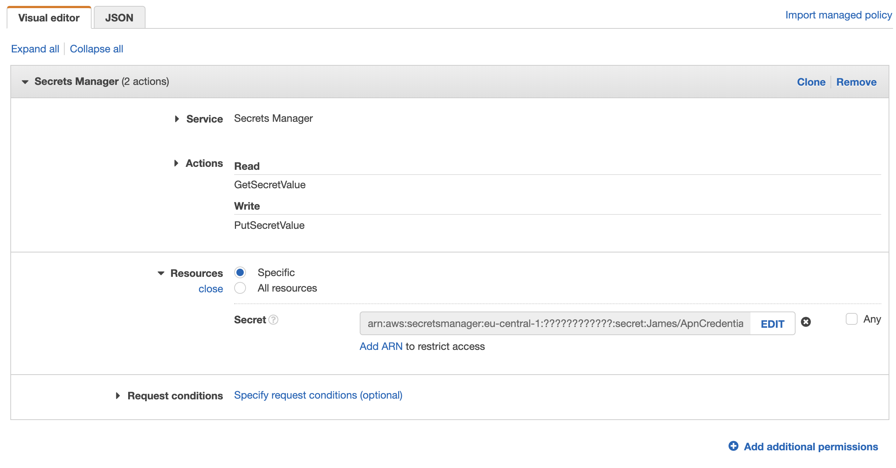
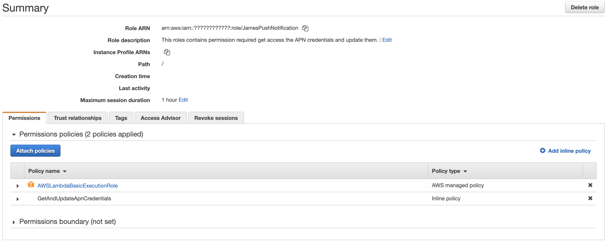
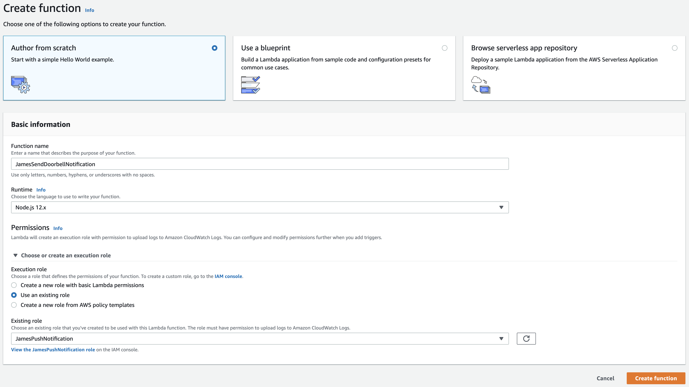
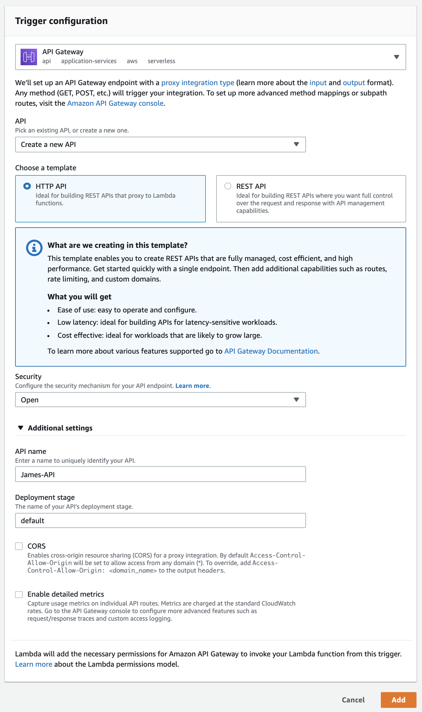
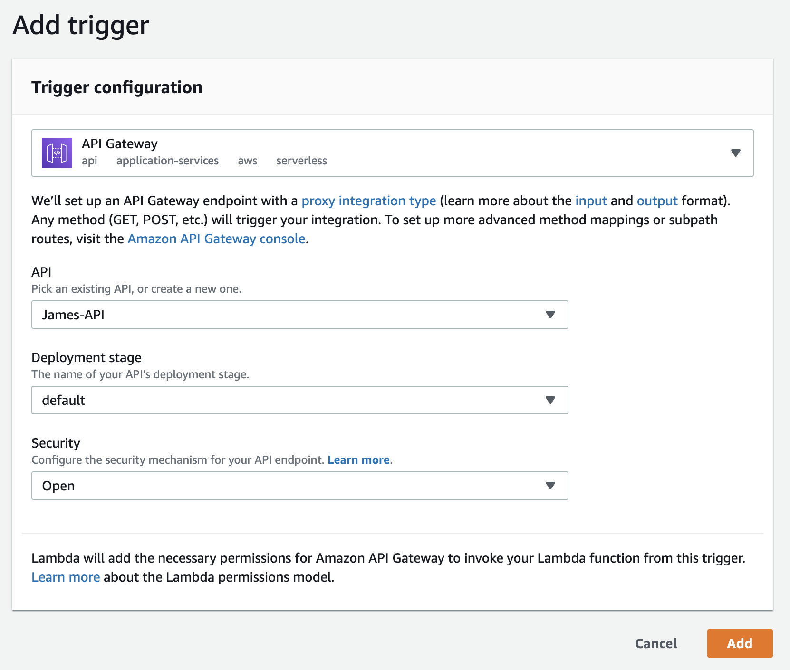

# James
## Problem
The goal of this software is to help people with hearing disability. For these people
sometimes it can be hard to hear when somebody rings at the door, especially since most
of the doorbells are using high frequency tones.
## Solution
Everyone has a smartphone. And most the time the smartphone is nearby the owner. So this
device can be used to inform the person about somebody who ringed at the door. Since
there are many hearing aids which are connected to the smartphone to make a sound when a
push notification arrived the phone, it is the optimal way to forward the doorbell signal
to the person.

The solution of the problem could be that when somebody uses the doorbell a push notification
is sent onto the smartphone of the people with the hearing disability. For best practise
the person should use hearing aids which are connected to the smartphone.
## Technical Requirements
The project requires an app on the users device which receives the push notifications. This
app can be relatively simple, since the main job is just be installed on the phone. The
app could show the user some basic infos how to use the system. And the app needs to register
itself to the sender of the push notifications.

Then the main part of the software is the device which sends the push notifications. This
device must detect when somebody uses the doorbell button. This could either be implemented
with a relay which are between the button at the front door and the ring itself. Another
option is to install an acoustical sensor which detects when the bell rings. But in the end
it does not make any difference to the software, because in both cases there are just one pin
which is read all the time when when it is in the HIGH state, the device fires a push
notification.
## Technical Solution
### Required Hardware
 - NodeMCU ESP8266
 - iPhone (iOS 13)
 - AWS Lambda
### Components
#### App
Currently there is only an app for iOS. This app is written in Swift. It does not make more
than receiving the push notifications.
#### Micro Controller
In this setup a NodeMCU ESP8266 is used. Since the ESP8266 microchip contains a wifi chip
and a full TCP/IP stack. So it easily can be used to communicate with the AWS Lambda. This
is written in Lua.
#### AWS Lambda
The lambda is used to communicate with the APN servers. It just receives a list of device
tokens and then sends the push notifications. This is written in JavaScript (Node.js engine).
## Progress
 - [x] Write down the problem
 - [x] Finding and write down a solution
 - [x] Checking the technical requirements
 - [x] Documenting a technical solution
 - [x] Implementing the app
 - [x] Writing the AWS Lambda function
 - [ ] Implementing the software for the NodeMCU
 - [ ] Update the documentation of the technical solution
 - [ ] Build a prototype
 - [ ] Find somebody to test the prototype
 - [ ] Documenting problems and find solutions
 - [ ] Optimize the implementation
 - [ ] Test it again (repeat the last steps if required)
 - [ ] Build a final prototype
 - [ ] Designing the app properly
 - [ ] Create an icon for the app
 - [ ] Build a helper tool to for easier setup of the NodeMCU
 - [ ] Support iPad and Mac Catalyst for the app
## Setup
To use this project please following the following steps:
### Build iOS app
Just open the iOS app in Xcode by just double pressing on the .xcodeproj file in the finder.
Then choose your certificate in the `Signing & Capabilities` tab, connect your iPhone, select
your device and run the app once. Xcode will install the app on your device. Your can close
Xcode after that.

**Note:** You must have a paid developer account at apple otherwise no push notifications can
be delivered to your device.

**Note:** Maybe you want to change the bundle identifier of the app. Just do that in the `General` tab.
### Create a key to send push notifications
You will need to create a key for the APN servers. Take a look at
[this tutorial](https://www.raywenderlich.com/8164-push-notifications-tutorial-getting-started#toc-anchor-007) 
which explains how to get one.
### Setup AWS Lambdas
In the next step you will setup the AWS lambdas. For that go into the AWS console.
#### Create secret
 - Goto the `Secret Manager`
 - Click on `Store a new secret`
 - Configure it like that: 
 - Give it a name (e.g `James/ApnCredentials`)
 - Disable `Disable automatic rotation`
 - Create the secret
#### Configure the role for the lambda function
 - Goto `IAM`
 - Click on `Roles` in the sidebar on the left side
 - Click on `Create role`
 - Keep the `AWS service` type
 - Choose `Lambda` under `Common use cases`
 - Click on `Next`
 - Search for the policy `AWSLambdaBasicExecutionRole` and check the checkbox next to it
 - Click on `Create policy`
 - Goto the `JSON` tab and paste the following configuration:
 ```json
{
    "Version": "2012-10-17",
    "Statement": [
        {
            "Sid": "VisualEditor0",
            "Effect": "Allow",
            "Action": [
                "secretsmanager:GetSecretValue",
                "secretsmanager:PutSecretValue"
            ],
            "Resource": "<<SECRET ARN>>"
        }
    ]
}
```
 - Copy the ARN from the created secret (in the `Secret Manager`) and replace the placeholder with it.
 - The configuration should look like that: 
 - Click on `Review policy`
 - Give it a name (e.g `GetAndUpdateApnCredentials`)
 - Create the policy
 - Click on `Next` twice
 - Give the role a name (e.g `JamesPushNotification`)
 - The roles should look like that: 
#### Create lambda functions
 - Goto `Lambda`
 - Click `Create function`
 - Fill in the fields like that: 
 - In the section `Designer` (first one) click the `Add trigger` button
 - Choose `API Gateway` like the following: 
 - Click `Add`
 - Execute the `prepare.sh` in the `JamesLambda` folder from this repository (this might take a moment)
 - In the section `Function code` choose `Upload a .zip file` at `Code entry type`
 - Press on `Upload` and choose file `JamesLambda/send-doorbell-notification/lambda.zip`
 - In the section `Environment variables` press on `Manage environment variables`
 - Add the variables
    - `APN_CREDENTIAL_SECRET_ID` -> the ARN of the secret (in `Secret Manager`)
    - `APN_SERVER` -> the apple APN server either `https://api.sandbox.push.apple.com` when the app is in
        development mode or `https://api.push.apple.com` when the app is in production mode
    - `APN_TOPIC` -> the bundle identifier of the app (when you didn't changed it: `de.schelbach.maximilian.JamesApp`)
 - Click on `Save` in the right upper corner
 - Create another lambda function like the first one.
    - This time name it something like `JamesRegisterDevice`
    - When creating the trigger configure it like that: 
    - Choose the `lambda.zip` file from the `register-device` folder
    - The environment variable are the same as in the first function
### Setup the NodeMCU
Coming soon...
