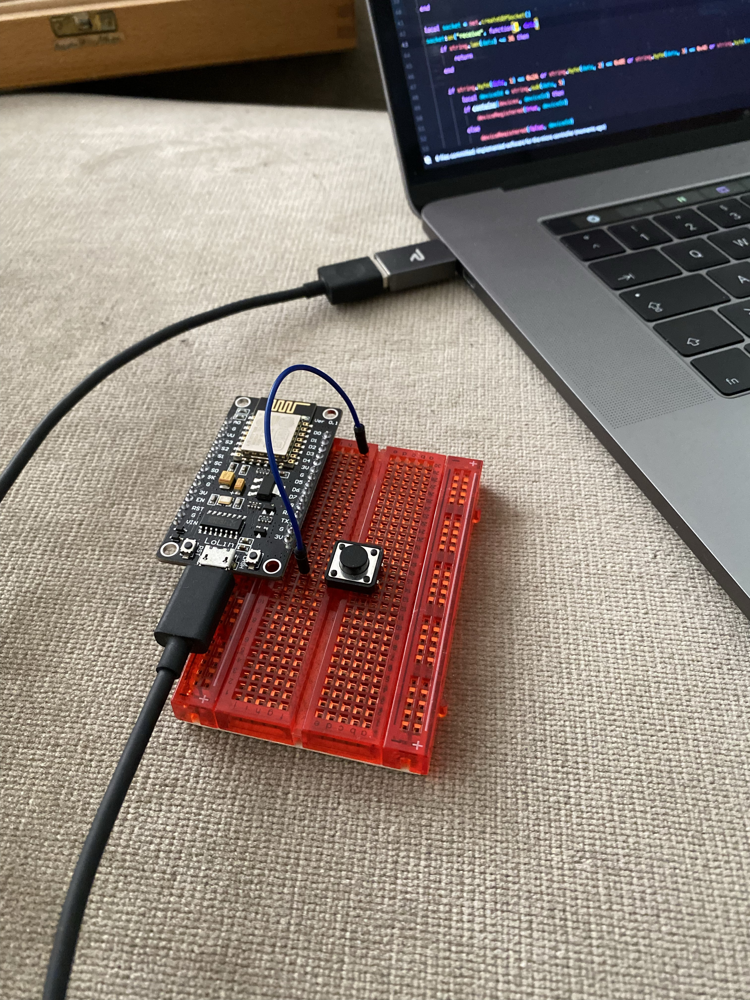

# James
## Problem
The goal of this software is to help people with hearing disability. For these people
sometimes it can be hard to hear when somebody rings at the door, especially since most
of the doorbells are using high frequency tones.
## Solution
Almost everyone has a smartphone. And most of the time the smartphone is nearby the owner. So this
device can be used to inform the person about somebody who ringed at the door. Since
there are many hearing aids which are connected to the smartphone to make a sound when a
push notification arrived at the phone, it is the optimal way to forward the doorbell signal
to the person.

The solution of the problem could be, that when somebody uses the doorbell a push notification
is sent onto the smartphone of the person with the hearing disability. For best practise
the person should use hearing aids which are connected to the smartphone.
## Technical Requirements
The project requires an app on the users device which receives the push notifications. This
app can be relatively simple, since the main job is just to be installed on the phone. The
app could show the user some basic infos of how to use the system. And the app needs to register
itself to the sender of the push notifications.

The main part of the software is the device which sends the push notifications. This
device must detect when somebody uses the doorbell button. This could either be implemented
with a relay which is installed between the button at the front door and the bell itself. Another
option is to install an acoustical sensor which detects when the bell rings. In the end
it does not make any difference to the software, because in both cases there is just one pin
which is read all the time and when it is in the HIGH state, the device fires a push
notification.
## Technical Solution
### Required Hardware
 - NodeMCU ESP8266
 - iPhone (iOS 13)
 - Node.js server
### Components
#### App
Currently there is an app for iOS only. This app is written in Swift. It only receives push
notifications and displays them to the user when the user is at home.
#### Micro Controller
In this setup a NodeMCU ESP8266 is used. Since the ESP8266 microchip contains a wifi chip
and a full TCP/IP stack, it can be used to communicate with the Node.js server. The software
for the micro controller is written in Lua.
#### Node.js server
The Node.js server is used to communicate with the APN servers. It receives a (list of) device
tokens and the type of the notification and sends the corresponding push notification. This is
written in TypeScript.
## Progress
 - [x] Write down the problem
 - [x] Finding and write down a solution
 - [x] Checking the technical requirements
 - [x] Documenting a technical solution
 - [x] Implementing the app
 - [x] Writing Node.js server
 - [x] Implementing the software for the NodeMCU
 - [x] Build a prototype
 - [ ] Find somebody to test the prototype
 - [ ] Documenting problems and find solutions
 - [ ] Optimize the implementation
 - [ ] Test it again (repeat the last steps if required)
 - [ ] Build a final prototype
 - [ ] Designing the app properly
 - [ ] Create an icon for the app
 - [ ] Build a helper tool to for easier setup of the NodeMCU
 - [ ] Support iPad and Mac Catalyst for the app
## Could supported in future
 - Report invalid device tokens to the NodeMCU so that devices which have uninstalled the app can be removed from the device list
 - Remove the push notification a after short while from the lock screen, so that not every notification keeps remaining in the notification center
## Setup
To use this project please following the following steps:
### Build iOS app
Open the Xcode project by double clicking on the .xcodeproj file in the finder.
Choose your certificate in the `Signing & Capabilities` tab, connect your iPhone, select
your device and run the app once. Xcode will install the app on your device. Your can close
Xcode after that.

**Note:** You must have a paid developer account at Apple otherwise no push notifications can
be delivered to your device.

**Note:** Maybe you want to change the bundle identifier of the app. Just do that in the `General` tab.
### Create a key to send push notifications
You will need to create a key for the APN servers. Take a look at
[this tutorial](https://www.raywenderlich.com/8164-push-notifications-tutorial-getting-started#toc-anchor-007) 
which explains how to get one.
### Setup Node.js server
This is pretty simple. Just go into the `JamesServer` directory and run:
```bash
npm install && npm run build && npm install -g
```
Now the `james-server` command is available on the device.
#### Configure
To configure you can use the interactive configuration tool with:
```bash
james-server init
```
#### Register device
After you configured the server, you need to create a configuration for your NodeMCU.
Use the interactive configuration tool with:
```bash
james-server register
```
#### Start the server
Now you can start the server with the command:
```bashj
james-server start
```
For best practice you should create a service on the device which starts automatically
on startup of the device.
### Setup the NodeMCU
#### Build the firmware
 - Clone the firmware with: `git clone https://github.com/nodemcu/nodemcu-firmware.git`
 - Edit the file `app/include/user_modules.h`
   - Enable the modules: `bit`, `crypto`, `file`, `gpio`, `net`, `tmr`, `wifi`
   - Disable all other modules
 - Build the firmware
   - If you have docker installed: `docker run --rm -ti -v $(pwd):/opt/nodemcu-firmware marcelstoer/nodemcu-build build`
   - If you are on linux: `make` (but the docker method has a higher success rate)
 - Install the `esptool` with: `pip3 install esptool`
 - Upload the firmware: `esptool.py --port <serial port> write_flash 0x00000 bin/0x00000.bin 0x10000 bin/0x10000.bin`
#### Upload the software
 - Install a tool like [ESPlorer](https://esp8266.ru/esplorer/) to upload file onto the micro controller
 - Upload the `config.bin` file generated while registering the device [look at Register device](#register-device)
 - Upload the `setup.lua` file from the `JamesHardware` folder
 - Run the `build.sh` in the `JamesHardware` folder
 - Upload generated the `init.lua` file from the `JamesHardware` folder
 - Run the command in the lua shell: `dofile("setup.lua")`
 - Connect the sensor to port `GPIO16` (port `D0` on a NodeMCU board)
 - Connect the board to a power supply
 - Now the system is completely installed!
## Images
Easy setup with just a button as sensor: 
The devliery of a message: 
